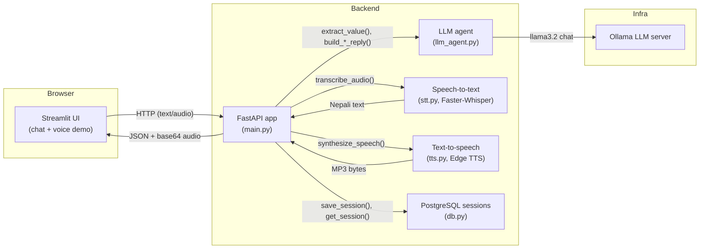
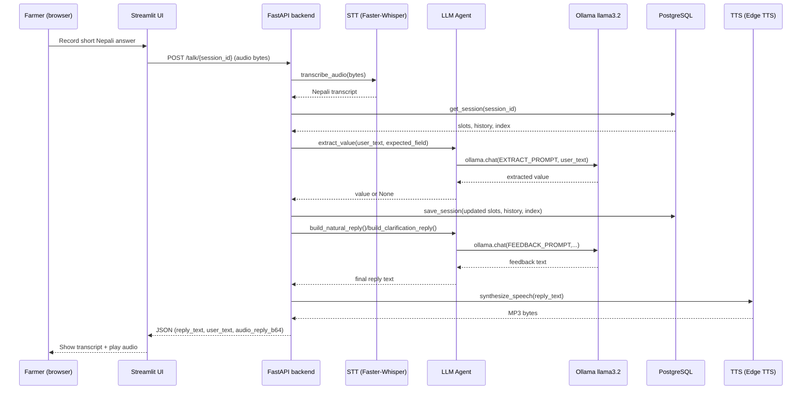

# Farmer Voice Agent

Farmer Voice Agent is a Nepali-language voice and text interview assistant for farmers.  
It runs fully locally using Ollama for LLM, Faster-Whisper for speech-to-text, Edge TTS for text-to-speech, PostgreSQL for session storage, a FastAPI backend, and a Streamlit frontend.

## High-level architecture



## Conversation sequence (voice path)



## Components

- **Streamlit UI (`streamlit_app.py`)** – Chat-style interface in Nepali with two modes: text-only and voice demo.
- **FastAPI backend (`main.py`)** – Orchestrates each turn: loads/saves session, picks the next question, calls STT/LLM/TTS, and returns JSON responses.
- **LLM agent (`llm_agent.py`)** – Defines the question list, prompts for value extraction and feedback, and builds natural Nepali replies using Ollama llama3.2.
- **Speech-to-text (`stt.py`)** – Uses Faster-Whisper "medium" with a Nepali primer to transcribe farmer speech.
- **Text-to-speech (`tts.py`)** – Uses Edge TTS Nepali voices (Hemkala/Sagar) and returns raw MP3 bytes.
- **Database layer (`db.py`)** – Stores per-session slots, conversation history, and current topic index in PostgreSQL.
- **Docker compose (`docker-compose.yml`)** – Spins up Ollama, Piper (or external TTS), PostgreSQL, and the FastAPI API container.

## Data model and sessions

- Each farmer session is keyed by `session_id` (UUID generated in the Streamlit app) and stored in the `sessions` table with:
  - `slots`: JSONB – collected field values like `name`, `crop`, `children_count`, etc.
  - `history`: JSONB – list of `{role, content}` messages.
  - `current_topic_index`: integer index into the ordered `QUESTIONS` list.

When a turn is processed, the backend:

1. Loads `slots`, `history`, and `current_topic_index` from PostgreSQL via `get_session`.
2. Finds the next unanswered question, skipping `abroad_countries` if `children_abroad` is zero-like (0, "०", "zero", "शून्य").
3. Calls `extract_value` to pull just the expected field value from the farmer's free-form answer.
4. Updates `slots` (and auto-fills `abroad_countries` when there are no children abroad).
5. Builds a friendly Nepali acknowledgement plus the next question using `build_natural_reply` or, if unclear, `build_clarification_reply`.
6. Saves the updated session back with `save_session`.
7. Returns the reply text, the current question, and a preview of the next question to the client.

## Running the project

### 1. Start backend and database

From the project root:

```bash
docker compose up --build
```

This starts:

- Ollama LLM server on port 11434.
- Piper or TTS container on port 10200.
- PostgreSQL `farmerdb` on port 5432.
- FastAPI backend on port 8000.

### 2. Install app dependencies (for local Streamlit)

In a second terminal:

```bash
python -m pip install -r requirements.txt
```

### 3. Start the Streamlit chat app

```bash
streamlit run streamlit_app.py
```

Open the displayed local URL in your browser. A new `session_id` will be created for each browser session, and the app will automatically call `/start/{session_id}` on the backend to begin the interview.

### 4. Run the text demo

- Keep mode set to **"टेक्स्ट"**.
- Type answers in Nepali into the chat input.
- The assistant will:
  - Ask structured questions about the farmer, family, crop, and irrigation.
  - Extract slot values and store them in PostgreSQL.
  - Respond with short, natural Nepali acknowledgements.

### 5. Run the voice demo

- Switch demo mode to **"आवाज"** in the Streamlit UI.
- Record a short spoken answer or upload a WAV file.
- The app will:
  - Send audio to `/talk/{session_id}`.
  - Show the transcribed Nepali text.
  - Play back the assistant reply using Edge TTS.

## For the demo: suggested narrative

You can pitch the project as a **local, privacy-preserving Nepali voice survey agent for farmers**:

1. **Problem** – Field surveys with farmers are manual, slow, and depend on enumerator training and connectivity.
2. **Solution** – A voice agent that talks to farmers in Nepali, understands free-form answers, and structures the data into slots that can go straight into a database.
3. **Tech angle** – Everything runs locally with Docker: Ollama LLM, Faster-Whisper STT, Edge TTS, PostgreSQL, FastAPI, and a Streamlit UI.
4. **UX** – Farmer just speaks or types; the agent handles clarification, acknowledgement, and storing clean data.
5. **Extensibility** – Swap out the `QUESTIONS` list, add more fields, or point the data to analytics dashboards or DBeaver for monitoring.

